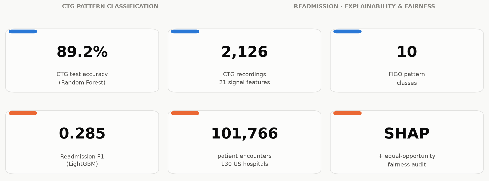
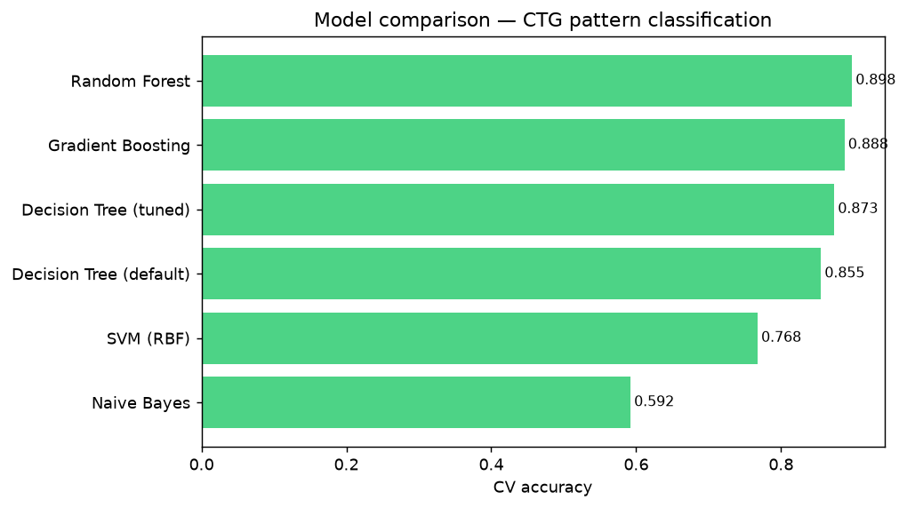

# Medical AI — Pattern Recognition & Fairness

Two case studies in clinical machine learning, chosen to show two different
halves of what it takes to put a model like this in front of a clinician:
getting a classifier to work well, and being able to say *why* it works and
*for whom*.

## [`ctg-classification/`](ctg-classification) — Fetal Heart-Rate Pattern Classification

Classic supervised classification pipeline on cardiotocography (CTG)
signals: EDA, preprocessing comparison, model selection across five
algorithms, feature importance mapped back to clinical meaning, and a
learning-curve check on generalization.

**Result:** Random Forest, 89.2% held-out accuracy. Top features
(accelerations, decelerations, variability) match standard obstetric
signals used by clinicians today.

## [`hospital-readmission-fairness/`](hospital-readmission-fairness) — Diabetic Readmission: Explainability & Fairness

Ensemble classification (Random Forest / LightGBM / XGBoost) on 100k+
hospital encounters, extended with **SHAP** explainability and a **fairness
audit** (equal opportunity by race/gender/age, plus a counterfactual check
for direct use of the race feature).

**Result:** LightGBM, F1 0.285. SHAP shows the model relies on clinically
sensible features (prior hospitalizations, discharge disposition); a
fairness audit finds a real recall gap by race that survives even though no
model uses the race feature directly — a proxy-discrimination pattern worth
flagging rather than a false alarm.

## Why these two together

A model that classifies well but can't be interrogated, or one that's
accurate on average but silently underserves a subgroup, isn't something you
can safely ship into a clinical workflow. Each project on its own shows one
half of that; together they're meant to show both.

Each folder is self-contained: a notebook with the full analysis (outputs
already saved, so no need to re-run anything to read it), a short `README.md`
report with the key figures, and a `scripts/generate.py` to regenerate
everything from scratch.
