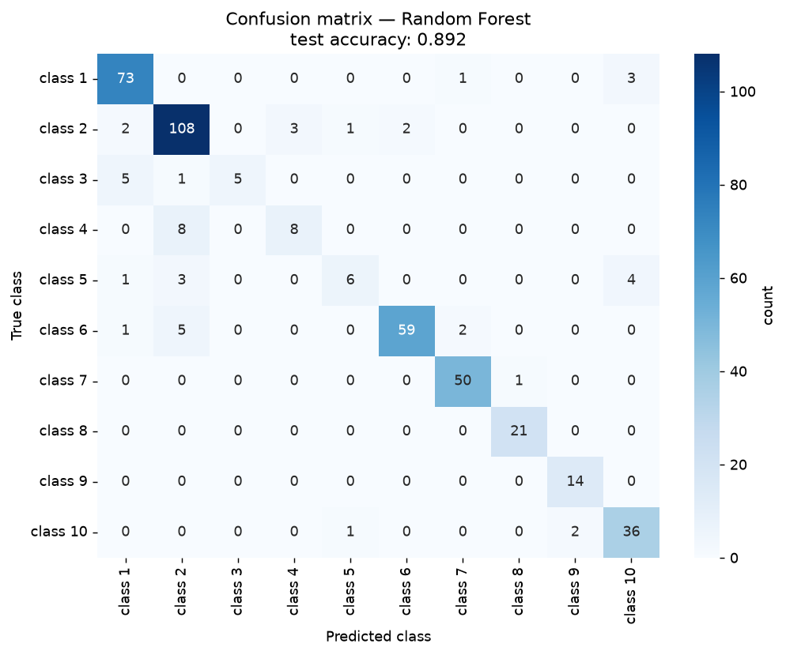
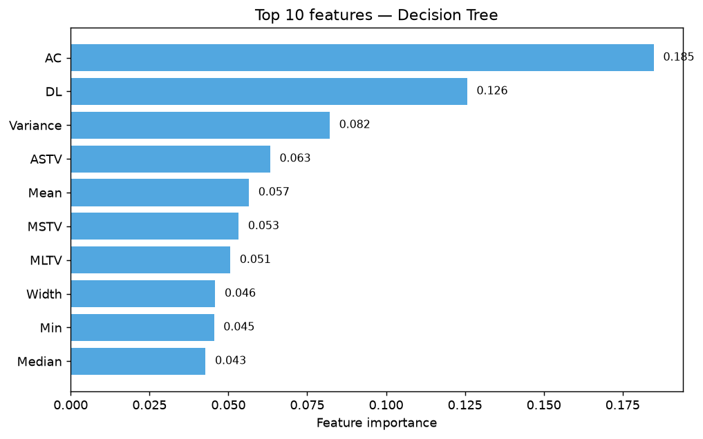
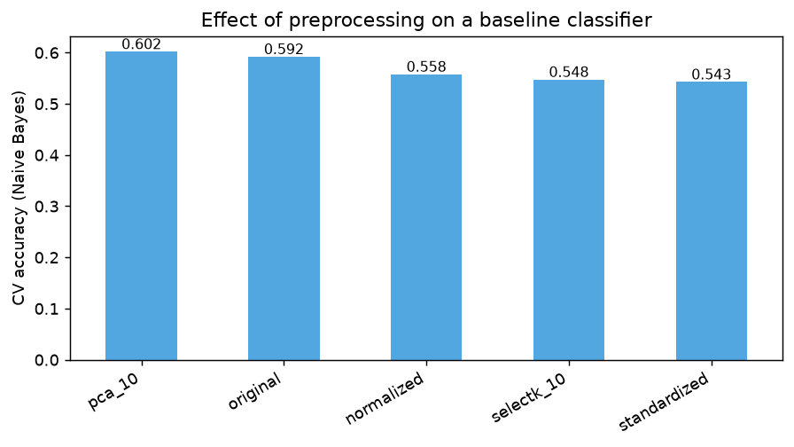
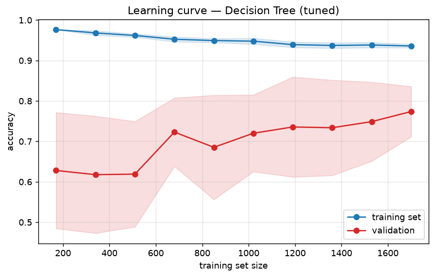

# CTG Fetal Heart-Rate Pattern Classification

Predicting the FIGO morphologic pattern class (1-10) of a fetal heart-rate
recording from 21 signal-derived features — [UCI Cardiotocography
dataset](https://archive.ics.uci.edu/dataset/193/cardiotocography), 2126
recordings.

## Result

| Model | 5-fold CV accuracy |
|---|---|
| **Random Forest** | **0.898** |
| Gradient Boosting | 0.888 |
| Decision Tree (tuned) | 0.873 |
| Decision Tree (default) | 0.855 |
| SVM (RBF, PCA features) | 0.768 |
| Naive Bayes | 0.592 |

Random Forest reaches **89.2% held-out test accuracy**. Most of the residual
error falls on the smallest classes (3, 4, 5, 9 — each under 4% of the
data), which is a class-imbalance problem rather than a modeling failure.




## Which features actually drive the prediction?

**Accelerations (AC)** and **light decelerations (DL)** dominate, followed by
FHR variance and short-term variability (ASTV) — all standard obstetric
signals. That the top features map cleanly onto recognizable physiology (not
some opaque combination) is what makes a model like this plausible as
clinical decision support rather than a black box.



## Preprocessing choice matters — but not the way you'd guess

Tree-based models did **best on the untouched original features** — PCA and
scaling actually hurt Decision Tree accuracy (0.87 → 0.62 under PCA). SVM is
the exception, since it needs a decorrelated, lower-dimensional input to
behave.



## Generalization

A learning curve for the tuned Decision Tree shows a moderate train/validation
gap (~0.16) — more labeled data or stronger regularization would likely help
before this went anywhere near production.



## Reproduce

```
pip install pandas numpy matplotlib seaborn scikit-learn
python scripts/generate.py       # regenerates every figure in figures/
# or open ctg_classification.ipynb — all outputs are already saved in the notebook
```

Data: `data/CTG.csv` (already included, exported from the original UCI
`.xls` file).
