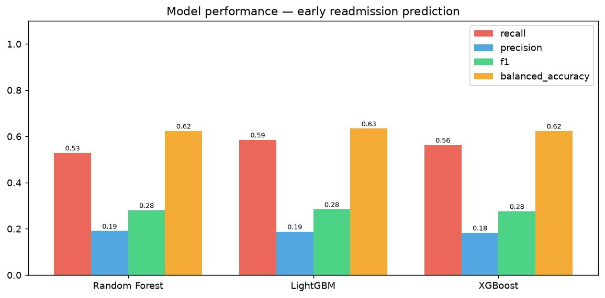
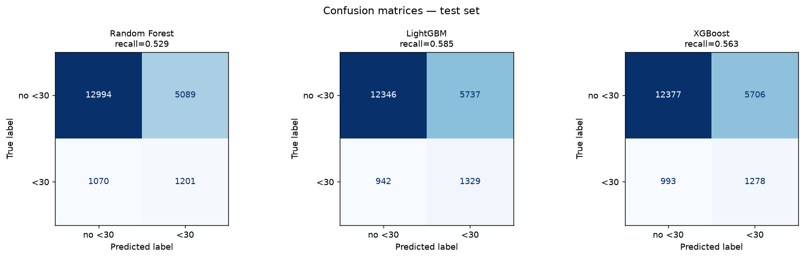
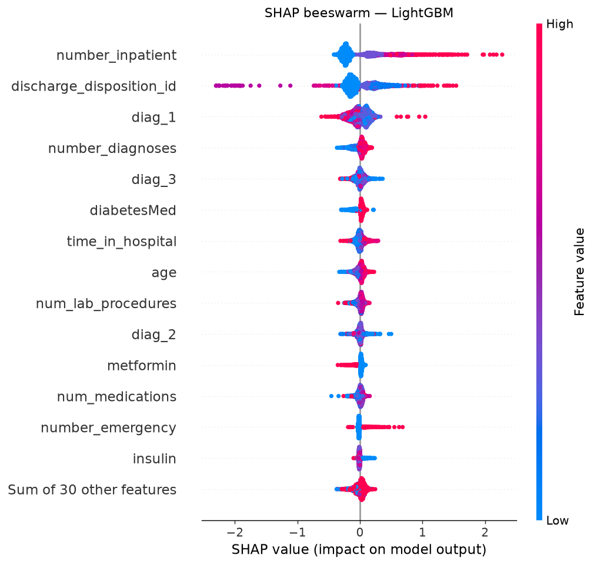
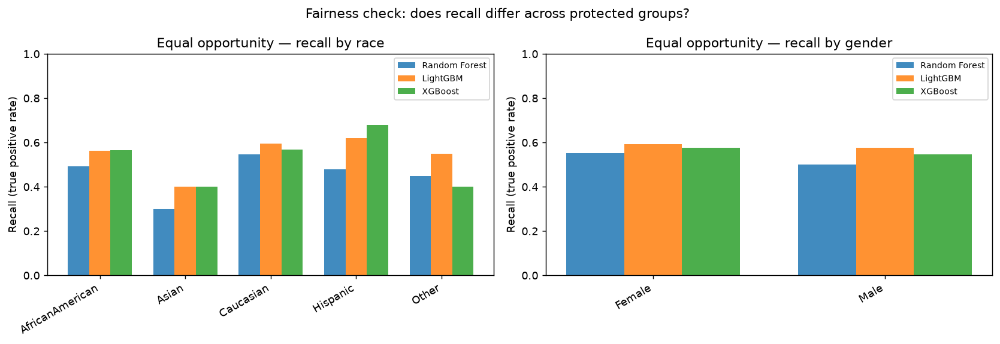
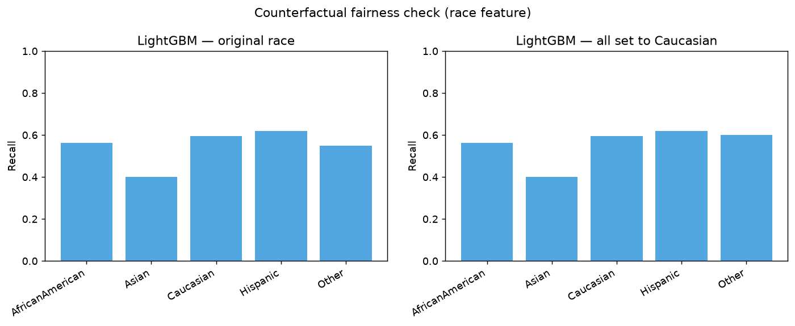

# Diabetic Patient Readmission — Explainability & Fairness

Predicting 30-day hospital readmission for diabetic patients — [UCI Diabetes
130-US hospitals dataset](https://archive.ics.uci.edu/dataset/296/diabetes+130-us+hospitals+for+years+1999-2008),
101,766 encounters, 1999-2008. Only **11.2%** of encounters end in a <30-day
readmission, so this is a hard, imbalanced, real-world target — the point of
this case study is less "maximize accuracy" and more "can we explain the
model, and is it fair?"

## Performance

| Model | Recall | Precision | F1 | Balanced accuracy |
|---|---|---|---|---|
| Random Forest | 0.529 | 0.191 | 0.281 | 0.624 |
| **LightGBM** | **0.585** | 0.188 | **0.285** | **0.634** |
| XGBoost | 0.563 | 0.183 | 0.276 | 0.624 |

Three tree ensembles with fixed, literature-typical hyperparameters (no
exhaustive tuning — the interesting part is what follows, not another
half-point of accuracy). LightGBM is marginally best and used for the
explainability/fairness analysis below.




## Explainability — SHAP

**Prior inpatient visits** and **discharge disposition** dominate the SHAP
ranking by a wide margin — both clinically sensible signals of a patient's
baseline risk, and neither a demographic attribute.



## Fairness audit — equal opportunity

Recall (the model's ability to actually catch true readmissions) is compared
across race, gender and age groups. Gender shows no meaningful gap; race
does — LightGBM's recall ranges from **0.40 (Asian) to 0.62 (Hispanic)**,
though the smallest groups also have the least data and the widest
uncertainty.



## Is the model actually using race, or a correlated proxy?

Setting every test patient's `race` to the majority value (`Caucasian`) and
re-predicting changes **under 1% of predictions** for every model — none of
them are using the `race` column directly. The recall gap above therefore
comes from features *correlated* with race (most likely prior-utilization
patterns), not the column itself. That's an important distinction: dropping
`race` from the feature set would not fix this gap, because the proxy signal
would still be there.



## Before this goes anywhere near clinical use

- Validate on data from a different hospital and time period.
- Collect more data for underrepresented groups (Asian, Hispanic are <2% of
  the dataset each) — the current fairness estimates for those groups carry
  wide uncertainty.
- Treat the race-recall gap as an open problem to monitor, not something
  solved by removing a column.

## Reproduce

```
pip install pandas numpy scikit-learn lightgbm xgboost shap ucimlrepo matplotlib
python scripts/generate.py       # re-downloads the dataset and regenerates figures/
# or open readmission_fairness.ipynb — all outputs are already saved in the notebook
```
